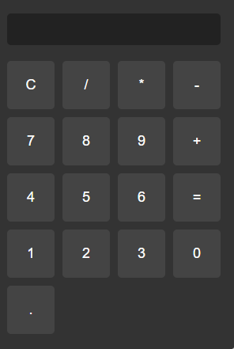
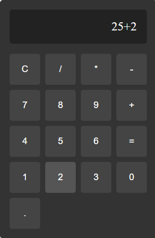
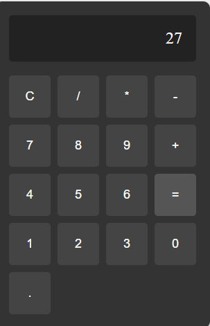

# JavaScript Calculator Project – README

## Adding Images to README


```



```


## Project Overview
This is a simple calculator built using HTML, CSS, and JavaScript. It performs basic arithmetic operations such as addition, subtraction, multiplication, and division.

---

## Project Structure
- **index.html** – Contains the HTML structure of the calculator.
- **style.css** – Contains the CSS for styling the calculator.
- **script.js** – Contains the JavaScript logic for calculator operations.

---

## Features
- User-friendly interface with responsive design.
- Basic arithmetic operations.
- Clear display and functional buttons.

---

## How to Run the Project
- Open the `index.html` file directly in any web browser.
- Alternatively, use VS Code with the Live Server extension for easier development.

---

## How to Use the Calculator
- Click on the number buttons to input values.
- Use the operator buttons to perform operations.
- Press `=` to calculate the result.
- Use `C` to clear the display.

---

## Technologies Used
- HTML
- CSS
- JavaScript

---

## Author
[Your Name]

---

## License
This project is licensed under the MIT License.
